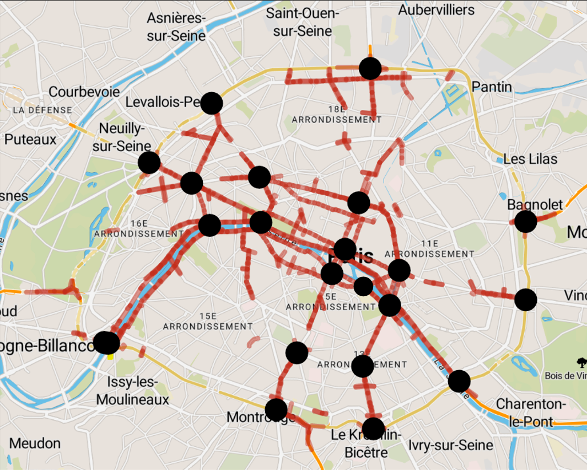

```{r librairies, include=FALSE, eval=TRUE}
library(XML)
library(RCurl)
library(magrittr)
library(mgcv)
library(tidyverse)
library(dplyr)
library(lubridate)
library(weathermetrics)
library(ranger)
```

# Présentation du rapport

# Le jeu de données

## Présentation des données

On présente maintenant les données que l'on a collectées et traitées afin de les utiliser dans la tâche de prédiction. 

**Données de comptage routier**

Les données de comptage routier sont disponibles sur le site **Paris Data** [@parisData], regroupant les jeux de données de la Ville de Paris, disponibles sur le site [@donneesComptage]. Elles sont collectées grâce à des boucles électromagnétiques implantées dans la chaussée sur plus de 3000 tronçons de voies. L'historique des données s'étend de 2014 à ???? au pas horaire, selon la variable **t_1h**. Chaque boucle électromagnétique mesure le traffic sur un arc entre un noeud amont et un noeud aval. Deux données principales sont fournies : le taux d'occupation, **k**, qui correspond au temps de présence de véhicules sur la boucle en pourcentage d’une heure et le débit, **q**, le nombre de véhicules ayant passé le point de comptage pendant une heure. Nous gardons également d'autres variables : l'identifiant de l'arc, **iu_ac**, le libellé de la voie correspondante, **libelle**, et l'état de l'arc, **state**. Ce dernier vaut 0 si l'état est inconnu, 1 si l'arc est ouvert à la circulation, 2 l'arc est fermé à la circulation et 3 si l'arc est invalide. Il n'est malheureusement pas expliqué la différence entre arc fermé et arc invalide dans la documentation. 

Pour une année, il y a environ 29 millions observations réparties sur plus de 3000 points. On a donc procédé à une transformation des données afin de réduire leur nombre et les structurer. La première étape est l'agrégation des points d'observation selon les libellés **libelle** associés dans le jeu de données et à l'aide de leur identifiant **iu_ac**. Ensuite, on a déterminé les principaux axes de Paris en moyennant le nombre de voitures par heure des points d'observations partageant un même libellé puis en choisissant les 200 premières valeurs (hors périphérique). On obtient le graphique \@ref(fig:200mainstreets) et on en déduit le graphe simplifié \@ref(fig:graphe) de Paris composé de 69 arêtes, correspondant à 69 jeux de données.

```{r 200mainstreets, out.width='50%', fig.align='center', fig.show='hold', fig.cap="Représentation en rouge des points d'observation associés aux 200 libellés les plus fréquentés (hors périphérique)", echo = F}
knitr::include_graphics('figures/200mainstreets.png')
```

```{r graphe, out.width='50%', fig.align='center', fig.show='hold', fig.cap="Graphe simplifié de Paris", echo = F}

```

On obtient finalement 2 variables au pas horaire : **nbCar** le nombre de voitures et **rateCar** le taux d'occupation. A partir de ces 2 variables, on en construit des autres en les retardant, d'une semaine (**nbCarLaggedWeek**, **rateCarLaggedWeek**), d'un jour (**nbCarLaggedDay**, **rateCarLaggedDay**) et d'une heure (**nbCarLaggedHour**, **rateCarLaggedHour**). En effet, il semble pertinent d'observer l'état du traffic routier à des temps antérieurs : historique à très court terme de l'heure précédente et historique au même instant du cycle journalier et hebdomadaire précédent. Cela est confirmé dans la partie ????.

Enfin, il est très important de noter que ces données sont incomplètes. Une étude approfondie de cette incomplétude et de la complétion est faite dans la partie ????.

**Variables temporelles**

Le traffic routier étant relié à l'activité humaine, nous avons ajouté de nombreuses variables temporelles (notamment grâce à la librairie *lubridate*).

- **year**, **month**, **day**, **hour** en décomposant la variable **t_1h**
- **time** le numéro de l'observation
- **toy** de 0 à 1 selon la position de l'observation dans l'année en cours
- **weekdays** le jour de la semaine et **weekendsIndicator** l'indicatrice si le jour est un jour du weekend
- **winterHolidaysIndicator** et **summerHolidaysIndicator** les indicatrices des vacances d'hiver et d'été définies à partir de [@calendrierScolaire]
- **bankHolidaysIndicator** l'indicatrice des jours fériés définie à partir de [@joursFeries]

**Index de la situation sanitaire en rapport avec le Covid-19**

Nous avons également ajouté, **covidIndex**, un index allant de 0 à 100 représentant les restrictions du gouvernement sur la situation sanitaire en rapport avec le Covid-19. Il est calculé à partir de nombreux indicateurs et est fourni par l'université d'Oxford [@covidIndex].

**Météo**

A partir de données de l'Organisation Météorologique Mondiale [@meteoData], nous avons extrait 2 variables météorologiques : **temperature** la température en Kelvin et **precipitation** les précipitations dans les 3 dernières heures en mm. Ces données ont été mesurées à Athis-Mons en Essonne. 

On dispose d'un relevé tous les 3 heures environ donc on procède à une interpolation pour compléter les données. Etant donné que les mesures sont uniformément réparties, on utilise une interpolation linéaire basique à l'aide de la fonction *na.approx* de la librairie *zoo*.

## Complétion du jeux de données du comptage routier

Malgré l'agrégation de plusieurs capteurs de mesure pour chaque arête, le jeu de données agrégé du comptage routier est incomplet et une partie importante du travail a été de le compléter. On représente dans la figure \@ref(fig:histograms) les histogrammes des pourcentages de valeurs manquantes. Les observations brutes du jeu de données sont de 2 types : mesure du taux d'occupation seul et mesure du taux d'occupation et du nombre de voiture (selon le type de capteur implanté dans la chaussée). Ainsi, il y a moins de mesures du nombre de voitures, comme on peut le voir sur les histogrammes des données agrégées. 

```{r histograms, echo=FALSE, fig.cap="Histogrammes", eval=TRUE}
edges = readRDS("../Data/data_agg69_plain/edges_dfs_allyrs.rds")

perctNbCar = c()
perctRateCar = c()
nbInd = nrow(edges[[1]])

for(l in 1:69){
  perctNbCar = c(perctNbCar, sum(is.na(edges[[l]]$q))/nbInd)
  perctRateCar = c(perctRateCar, sum(is.na(edges[[l]]$k))/nbInd)
}

par(mfrow=c(1,2)) 
hist(perctNbCar, breaks=seq(0,1,0.01), main = "Nombre de voitures", xlab = "% de valeurs manquantes", ylab = "Effectif")
hist(perctRateCar, breaks=seq(0,1,0.01), main = "Taux d'occupation", xlab = "% de valeurs manquantes", ylab = "Effectif")
```

## Etude descriptive des données

## Stratégie de prévision

**Choix des jeux de données**

On découpe notre jeu de données en 2 parties de proportion 2/3 et 1/3 : une partie apprentissage de 2014 à 2017 et une partie test de 2018 à 2019. Ainsi, on pourra évaluer les performances de nos modèles sur les différentes périodes d'une année. 

**Choix de la métrique**

Pour évaluer ces performanes, on choisit la métrique Root Mean Square Error (RMSE) qui représente la racine carrée du deuxième moment d'échantillonnage des différences entre les valeurs prédites et les valeurs observées. On n'utilise pas la métrique Mean Absolute Percentage Error (MAPE) car un nombre important des valeurs de **rateCar** sont nulles. 

**Modèles naïfs à battre**

Afin de comparer nos modèles, on construit 3 modèles témoins. Ces modèles sont dit naïfs car extrêmement simpliste :

* **naiveModel1** prévoit le taux d'occupation d'une heure $t \in \{ 0, \dots, 23 \}$ d'un jour $j \in \{ 1, \dots, 7\}$ d'un mois $m \in \{ 1, \dots, 12 \}$ d'une année $a \in \{ 2018, 2019 \}$ en moyennant les taux d'occupation de l'heure $t$ du jour $j$ du mois $m$ pour toutes les années $a \in \{ 2014, \dots, 2017 \}$.

* **naiveModel2** fait de même en calculant la médiane et non la moyenne.

* **naiveModel3** est simplement le taux d'occupation à l'heure précédente **rateCarLaggedDay**.

On calcule la moyenne des erreurs RMSE pour les 69 arêtes :

```{r naiveModel table, echo=FALSE}
df_naiveModels <- data.frame(5.844, 5.899, 3.955)
names(df_naiveModels) <- c("naiveModel1", "naiveModel2", "naiveModel3")

knitr::kable(df_naiveModels, align = "ccc", caption = "Performances des modèles naïfs témoins")
```

**Recherche de paramètres**

Afin d'optimiser les performances de nos différents modèles, nous effectuons de la recherche de paramètres. On utilise les 2 méthodes suivantes :

* Validation croisée sur 16 blocs. On divise ainsi nos 4 années de données d'apprentissage en blocs de 3 mois, ce qui englobe les différentes saisonnalités de nos données. On a codé cette méthode à la main dans la fonction ....

* Validation croisée progressive, où on fixe une fenêtre initiale d'apprentissage de 2 ans, que l'on incrémente dans l'ordre chronologique de 2 mois à chaque itération, pour entraîner le modèle et mesurer sa performance à l'horizon 1 (c'est-à-dire prédire le taux d'occupation de l'heure suivante). Pour utiliser cette méthode, on utilise le package **caret** avec le paramètre *timeSlice*.

```{r CVprogressive, out.width='50%', fig.align='center', fig.show='hold', fig.cap="Validation croisée progressive [@CVprogressive]", echo = F}
knitr::include_graphics('figures/CVprogressive.png')
```

La caractéristique des données de type série temporelle est qu'elles sont ordonnées et possèdent une dépendance temporelle. C'est pourquoi il semble pertinent de ne pas mélanger les observations avant de découper le jeu de données en données apprentissage et données test. De plus, il semble aussi important de ne pas utiliser des données futures pour prédire le passé. Dans la validation croisée, il est donc naturel de retirer les blocs d'apprentissage ultérieurs au bloc test. C'est la validation croisée progressive. Cependant, en pratique, on souhaite entraîner le modèle une unique fois sans le mettre à jour tous les 2 mois. Dans ce cas, la validation croisée est plus pertinente. 

Lors de nos recherches de paramètres, nous avons observé que les 2 méthodes sélectionnent des paramètres proches. Finalement, on se base sur la validation croisée en 16 blocs pour la recherche de paramètres. 

Pour permettre la reproductibilité des résultats, on fixe la graine du générateur aléatoire. De plus, on effectue la recherche de paramètre pour une seule arête sur les 69 car c'est un processus long et on fait l'hypothèse que le paramètre optimal pour la prévision sur une arête est proche de celui de toutes les autres arêtes.  

# Modèles

## Arbres

Le premier modèle construit est un arbre aléatoire à l'aide du package *rpart*. On optimise le paramètre **cp** (complexity parameter) sur 2 grilles : la première de 0.0 à 0.1 et la seconde, plus fine, de 0.0 à 0.01. 

```{r arbreGrille1, fig.cap = "Recherche du paramètre cp optimal", out.width='100%', fig.align='center', fig.show='hold', echo = F}
knitr::include_graphics('figures/arbre_grille.png')
```

Le paramètre **cp** est le paramètre le plus important à optimiser. Dans la construction de l'arbre, si le gain de performance après une découpe n'est pas meilleur d'un facteur de **cp**, alors la découpe n'est pas réalisée. Dans notre cas, la valeur optimale est **cp=0**, c'est-à-dire que l'on accepte toutes les découpes et que notre arbre est un arbre profond. 

## Forêts aléatoires


# Conclusion


