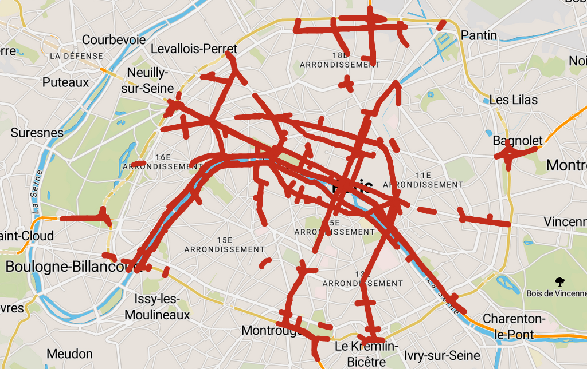
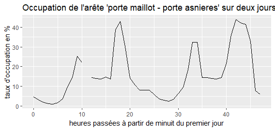
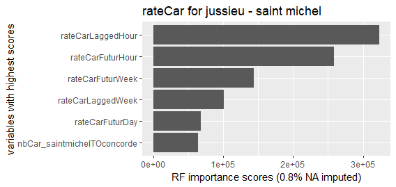
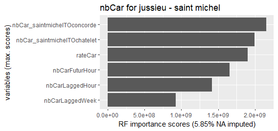
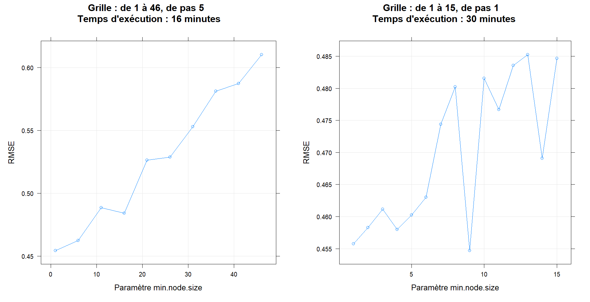
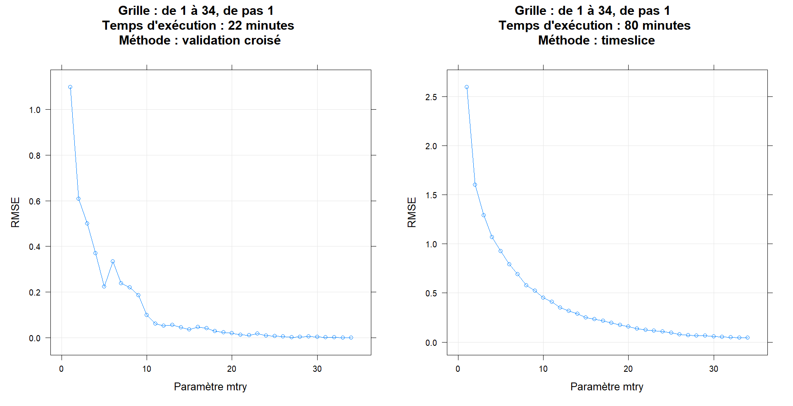
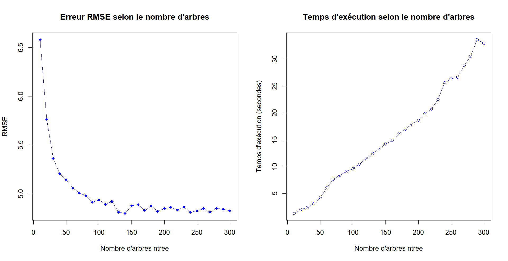
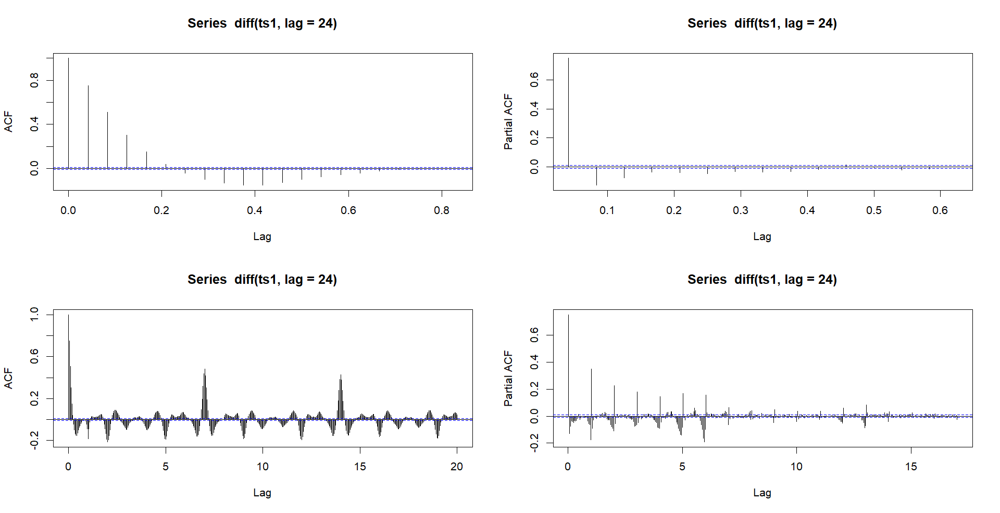

<style>
body {
text-align: justify}
</style>

```{r librairies, include=FALSE, eval=TRUE}
library(gratia)
library(XML)
library(RCurl)
library(magrittr)
library(mgcv)
library(tidyverse)
library(dplyr)
library(lubridate)
library(weathermetrics)
library(ranger)
library(cowplot)
library(ProjetML1)
```

# Introduction : la circulation à Paris
La ville de Paris rend publiquement accès à de nombreux jeux de données sur la circulation routière de la ville. La découverte du site web *Paris Data* [@parisData] nous a motivé à utiliser cette ressource dans notre projet de prédiction. La possibilité de relier les différents capteurs dans une structure de graphe nous a intéressé. D'une part, cela motive des études du réseau entier : peut-on construire un algorithme global, qui apprend les interactions dans le réseau entier ? D'e l'autre côté'autre part, l'examination de rues individuelles mène à des questions sur la corrélation locale de la circulation. Un grand boulevard se comporte-t-il comme ses avenues voisines ? Enfin, dans tout cela, nous nous poserons la question à quel horizon temporel nous réussirons à prédire la présence de voitures dans les rues de Paris.

Avant de nous lancer, nous présentons d'abord le jeu de données en détail, sa richesse mais aussi les difficultés qu'il apporte : Sa taille et les valeurs manquantes. Ayant passé une grande partie du projet sur cet aspect, nous présentons nos stratégies pour résumer et compléter ce data set.

Cela fait, nous formulons plusieurs problèmes de prédiction, à différents horizons temporels et en utilisons différentes parties du data set. (TODO: spécifier à la fin pour avoir une petite table de matières ici)

# Préparer le jeu de données

## Les données et leurs attribus

Sur le site *Paris Data*, on trouve énormément de jeux de données issus des activités de la ville, notamment sur le comptage routier [@donneesComptage]. Ces données sont collectées en continu grâce à des boucles électromagnétiques implantées dans la chaussée sur plus de 3000 tronçons de voies. Ces boucles et bornes de comptage mesurent principalement deux choses: le nombre de voitures qui passent et l'occupation du tronçon de route. Disponibles de 2014 jusqu'à aujourd'hui, ces deux données sont mesurées au pas horaire, résultant en environ 
$$
8 \text{ ans } \times 365 \text{ jours } \times 24 \text{ heures } \times 3000 \text{ capteurs } = 2.1\times10^8 \text{ observations dans le data set.}
$$

Chacune de ces lignes contient les informations suivantes, qui serons nos variables explicatives $X_i$. Les noms des variables que nous utilisons dans notre analyse sont écrits en **gras** tout au long de cet exposé.

- Un timestamp **t_1h** indiquant date et heure de la mesure.
- Le nombre de voitures ayant passé le point de comptage pendant une heure, noté **q** et renommé par **nbCar**.
- Le taux d'occupation, correspondant au temps de présence de véhicules sur la boucle en pourcentage d’une heure, noté **k** et renommé par **rateCar**.
- La variable **etat_barre** indique si la route où se trouve la borne de comptage est "barée", **etat_barre**=2, ou "ouverte", 1. Nous la renommons **state**. Malheureusement, cette variable a souvent la valeur "inconnu", 0, ou "invalide", 4. La différence entre 3 et 4 est un mystère et par conséquence nous nous servons peu de cette variable.
- L'identifiant **iu_ac** de chaque borne. Chaque ligne contient de informations sur les compteurs adjacents.
- Le libellé (**libelle**) du tronçon de rue où est placé le capteur, par exemple "Champs Elysées partie B".

Les données historiques de circulation sont enregistrées sur le site web *Paris Data* sous le format *.txt*. Chaque fichier couvre toutes les bornes pour une semaine. Pour commencer, il faut donc télécharger les fichiers de toutes les semaines et les convertir en dataframes. Ce faisant, nous effectuons également un tri par identifiant de borne **iu_ac**.

## Simplification et aggrégation

Au vue de la quantité énorme de 200 millions d'observations, nous sommes obligés de réduire la taille du dataset. La première démarche consiste à garder les variables intéressantes: **t_1h**, **nbCar**, **rateCar** et **iu_ac**. 

Ayant réduit la dimension de chaque observation, la deuxième étape est la réduction du nombre de capteurs de comptage. Pour ce faire, nous utilisons un modèle simplifié des rues de Paris. Etant donné que les capteurs couvrent les grandes axes routiers, dont le périphérique, notre objectif était d'*agréger* les données selon ces grands axes. Afin d'identifier où passent le plus de voitures, nous calculons les moyennes de **nbCar** pour chaque libellé, c'est-à-dire les moyennes à travers le temps et pour toutes les bornes associées à chaque libellé. En prenant les 200 libellés dont le nombre de voitures est le plus grand (hors périphérique), nous obtenons le graphique \@ref(fig:200mainstreets) qui représente très bien les axes routiers auxquels on s'attendait.  
Ensuite, nous ignorons les libellés et regardons exclusivement ce graphique. De manière arbitraire, nous en déduisons le graphe de la figure \@ref(fig:graphe), un schéma très simplifié de la circulation à Paris. Grâce à notre démarche d'utiliser les rues les plus fréquentées, cette abstraction nous permet d'avoir un modèle représentatif de la circulation parisienne.

```{r 200mainstreets, out.width='50%', fig.align='center', fig.show='hold', fig.cap="Représentation en rouge des bornes d'observation associés aux 200 libellés les plus fréquentés (hors périphérique)", echo = F}

```

```{r graphe, out.width='50%', fig.align='center', fig.show='hold', fig.cap="Graphe simplifié. Les points noirs indiquent les intersections entre nos arêtes. ", echo = F}
knitr::include_graphics('figures/plan_abstrait_notre_modele.jpg')
```

Chaque arête dans le graphe \@ref(fig:graphe) regroupe plusieurs capteurs dont nous agrégeons les données : après une collecte minutieuse et laborieuse des identifiants de toutes les bornes sur chacune des arêtes, nous associons pour chaque heure la moyenne de **nbCar** et **rateCar** des bornes de l'arête dont ils font partie. Cela a trois avantages: 

1. Prendre la moyenne évite d'avoir des données manquantes, issues entre autres de capteurs dysfonctionnels sur une certaine période. Ce n'est pas toujours le cas, comme on le verra dans la section suivante.
2. S'il y a des capteurs où les données fluctuent beaucoup en raison de mauvais positionnement ou des perturbations indésirées, la moyenne réduit cette variance.
3. Le problème est réduit à 69 arêtes représentées par 69 dataframes. 

Cette réduction des données résulte en la construction des jeux de données que l'on va manipuler et en la concrétisation du problème que l'on souhaite résoudre. Elle permet également d'obtenir des objets que nos ordinateurs sont capables de stocker efficacement. Il reste pourtant un problème: la présence de données manquantes. 

## Complétion de valeurs manquantes

En examinant des figures basiques des taux d'occupation, nous observons régulièrement une image comme dans le graphique \@ref(fig:plotjourNA) Malgré l'agrégation le long des arêtes, il reste un nombre considérable de valeurs manquantes, *NA*, dans le dataset. Afin d'exécuter des tâches de prédiction, il nous faut cependant des données complètes. Une partie conséquente de notre travail a donc été de compléter les valeurs manquantes.

```{r plotjourNA, out.width='50%', fig.align='center', fig.show='hold', fig.cap="Taux d'occupation pour une journée ouvrière avec une valeur manquante", echo = F}

```

```{r NAdistribution, out.width='50%', fig.align='center', fig.show='hold', fig.cap="Visualisation de valeurs manquantes pour 30 arêtes (gris = NA)", echo = F}
knitr::include_graphics('figures/impMissing25_ready.png')
```

En regardant le graphique \@ref(fig:NAdistribution), on considère qu'il y a deux types de "trous" dans le data set:

1. Des valeurs manquantes *ponctuelles* comme on a pu observer dans la figure \@ref(fig:plotjourNA) ou celles marquées en bleu dans le graphique ci-dessus. On peut deviner qu'il s'agit de simples erreurs dans la collection des données ou des travaux d maintenance par exemple.
2. Des trous plus grands, couvrant parfois plusieurs mois, comme ceux marqués en rouge dans le graphique \@ref(fig:NAdistribution). Il peut s'agir d'une absence étendue de plusieurs bornes, une clôture de la route en raison d'une construction, etc. Savoir si une route est effectivement inaccessible pendant de longues période serait une tâche de recherche en soi : comme mentionné plus tôt, la variable **state** ne contient presque aucune information. Nous remplissons alors les grands trous sans respecter d'éventuelles fermetures, ajoutant une autre simplification.

Le fait que les arêtes ont de différentes structures de valeurs manquantes peut aussi être observé en regardant la répartition du pourcentage de *NA*'s à travers les dataframes dans la figure \@ref(fig:histograms).

```{r histograms, echo=FALSE, fig.align='center', fig.cap="Distribution des valeurs manquantes", eval=TRUE}
edges = readRDS("../Data/data_agg69_plain/edges_dfs_allyrs.rds")

perctNbCar = c()
perctRateCar = c()
nbInd = nrow(edges[[1]])

for(l in 1:69){
  perctNbCar = c(perctNbCar, sum(is.na(edges[[l]]$q))/nbInd)
  perctRateCar = c(perctRateCar, sum(is.na(edges[[l]]$k))/nbInd)
}

par(mfrow=c(1,2)) 
hist(perctNbCar, breaks=seq(0,1,0.01), main = "Nombre de voitures", xlab = "% de valeurs manquantes", ylab = "Effectif")
hist(perctRateCar, breaks=seq(0,1,0.01), main = "Taux d'occupation", xlab = "% de valeurs manquantes", ylab = "Effectif")
```

Nous observons que les données de taux d'occupation sont généralement plus complètes : ceci est dû au fait qu'il y a plus de capteurs de ce type. Par ailleurs, nous avons vérifié qu'une valeur manquante de **nbCar** implique toujours un *NA* dans **rateCar**.

Pour remplir les trous, la première étape consiste à ajouter des variables explicatives supplémentaires. En fonction du type de trou, nous verrons qu'ils auront un impact important sur la complétion.

###  Variables supplémentaires : Proximité temporelle et locale

Pour l'instant, nous disposons des variables **nbCar** et **rateCar** pour chaque arête et chaque heure entre 2014 et 2020. Nous exploitons deux propriétés structurelles des données pour obtenir de l'information supplémentaire:

D'abord, il s'agit de séries temporelles, donc nous rajoutons les valeurs historiques de **nbCar** et **rateCar** décalées d'une heure, d'un jour et d'une semaine (**nbCarLaggedHour**, **nbCarLaggedDay**, et **nbCarLaggedWeek**) comme variables explicatives. L'espoir étant que la circulation reste identique à travers ces cycles. Avec l'objectif spécifique de compléter les données manquantes, il est aussi pertinent d'ajouter ces valeurs du futur (**rateCarFuturHour** etc.), étant donné que le modèle d'imputation a pour but d'interpoler au lieu d'extrapoler. On fait l'hypothèse que toutes ces variables décalées seront efficaces pour remplir les trous *locaux* : une heure ou une journée manquante devrait facilement être inférée en utilisant des données qui sont proches dans le temps.

Pour les valeurs manquantes au milieu des grands trous, nous n'avons pas accès aux heures et jours d'avant car elles sont aussi manquantes. Cependant, grâce à l'interconnexion de nos données à travers le graphe présenté plus haut, les mesures de circulation d'une arête peuvent bien être expliquées en fonction de celle de ces voisines. Dans un effort manuel, nous avons pour chaque arête $A$ collectionné des voisins $V_i$, dans le sens que les voitures dans $A$ passent ensuite par l'un des $V_i$ ou bien l'inverse. Nous faisons ici encore des choix arbitraires de qui est voisin de qui pour deux raisons. Premièrement, inférer statistiquement quelle arête influence quelle autre nécessiterait des données déjà complètes pour une régression par exemple. Deuxièmement, utiliser toutes les autres 68 arêtes au lieu de juste 2 à 6 voisins augmenterait trop le temps d’exécution de la complétion.  
Donnons un exemple illustrant le choix de voisins ainsi que la dénomination des nouvelles variables. Parmi les voitures qui entrent dans Paris par l'arête "pont amont - pont austerlitz", il y a une partie considérable qui continue tout droit sur l'arête "pont austerlitz - chatelet". Par conséquent, nous ajoutons la variable **rateCar_pontausterlitzTOchatelet** au dataframe de "pont amont - pont austerlitz".

Jusqu'ici, nous n'avons utilisé que des informations déjà présentes dans le jeu de données. Dans la suite, nous ajoutons des variables extérieures qui pourraient également expliquer la circulation routière.

### Variables supplémentaires : Facteurs externes

**Variables temporelles**

Le traffic routier étant relié à l'activité humaine, nous avons ajouté de nombreuses variables temporelles (notamment grâce à la librairie *lubridate*).

- **year**, **month**, **day**, **hour** résultent d'une simple décomposition des timestamps **t_1h**,
- **time** est un simple compteur de journées, commençant à $1$ le 1er janvier 2014,
- **toy** (time of year), il s'agit d'un numéro entre 0 et 1 indiquant la position de l'observation dans l'année en cours,
- **weekdays** le numéro du jour de la semaine et **weekendsIndicator** l'indicatrice si le jour est un jour du weekend,
- **winterHolidaysIndicator** et **summerHolidaysIndicator** les indicatrices des vacances d'hiver et d'été définies à partir de [@calendrierScolaire],
- **bankHolidaysIndicator** l'indicatrice des jours fériés définie à partir de [@joursFeries].

**Index de la situation sanitaire en rapport avec le Covid-19**

Nous avons également ajouté, **covidIndex**, un index allant de 0 à 100 représentant les restrictions du gouvernement sur la situation sanitaire en rapport avec le Covid-19. Il est calculé à partir de nombreux indicateurs et est fourni par l'université d'Oxford [@covidIndex]. Cette variable permettra éventuellement une étude de l'année 2020 qui voit une circulation perturbé. Pour cela, il faudra utiliser des modèles qui s'adaptent très vite à l'influence de nouvelles variables.

**Météo**

A partir de données de l'Organisation Météorologique Mondiale [@meteoData], nous avons extrait 2 variables météorologiques : **temperature** la température en Kelvin et **precipitation** les précipitations dans les 3 dernières heures en mm. Ces données ont été mesurées à Athis-Mons en Essonne. 

On dispose d'un relevé tous les 3 heures environ donc on procède à une interpolation pour compléter les données. Etant donné que les mesures sont uniformément réparties, on utilise une interpolation linéaire basique à l'aide de la fonction *na.approx* de la librairie *zoo*.

## Complétion via Random Forest

Avec un dataframe enrichi à notre disposition pour chacune des arêtes du graphe de circulation, nous pouvons passer au remplissage des valeurs manquantes. Nous sommes pourtant restreint dans notre recherche d'un algorithme d'imputation car plusieurs variables explicatives contiennent également des *NA*. D'une part, nous voulons remplir deux variables en même temps (**nbCar** et **rateCar**). D'autre part, les voisins n'ont pas moins de valeurs manquantes, laissant de grands trous dans le dataframe.  
Heureusement, il y a un modèle qui peut être entraîné en dépit de valeurs manquantes parmi les variables : les forêts aléatoires constituées d'arbres CART. Une règle de décision dans un tel arbre peut être ignorée si la valeur de la variable nécessaire n'est pas renseignée. Le package `miceRanger` profite de ce fait en utilisant un algorithme dit d'imputation multiple : en commençant par la variable $V_1$, une forêt aléatoire est entraînée sur les lignes où $V_1$ n'est pas manquant. Puis, les autres lignes sont "prédites" par la forêt. Avec le nouveau dataset moins vide, le processus est reproduit et ainsi de suite [@miceRanger]. Nous nous arêtons pourtant à la deuxième itération vu qu'il n'y a pas d'intérêt à compléter les données des voisins.

Comme nous répétons le processus de complétion 69 fois, le temps d’exécution est de quelques heures sur nos ordinateurs. Nous n'avons donc pas le luxe d'optimiser des hyperparamètres comme nous ferons plus tard pour la tâche de prédiction. Le choix de 100 arbres par forêt et 7 variables considérées à chaque split semble un bon compromis. (voir le fichier *preprocessing/missing_data.R* sur git pour le code exact).

Au délà des capacités de complétion, les forêts aléatoires permettent de calculer des scores d'importance pour chaque variable explicatives. Ces scores peuvent aider à identifier lesquelles des variables ont le plus contribué à l'estimation de la cible (le score est calculé comme la réduction de variance à chaque split). Pour une arête du graphe, *jussieu - saint michel*, nous illustrons les variables qui ont le plus contribué à l'imputation :

```{r rateCarImpute, out.width='50%', fig.align='center', fig.show='hold', fig.cap="Variables avec le score d'importance le plus haut pour **rateCar** de l'arête ''jussieu - saint michel''", echo = F}

```

```{r nbCarImpute, out.width='50%', fig.align='center', fig.show='hold', fig.cap="Variables avec le score d'importance le plus haut pour  **nbCar** de l'arête ''jussieu - saint michel''", echo = F}

```

Sur l'arête dont traitent les deux plots, on observe que **rateCar** et **nbCar** exhibent deux comportement assez différents. Pour le taux d'occupation, ce sont presque exclusivement les valeurs temporellement décalées qui contribuent à l'imputaion. Comme il y seulement 0.8% de valeurs à compléter, ceci confirme notre hypothèse que les petits trous d'une ou plusieurs heures sont très bien complétés par les valeurs des heures juste avant ou après. Pour le nombre de voitures, où la proportion de *NA* était plus importante, les deux variables ayant le plus réduit les variances aux splits sont des variables **nbCar** issues d'arêtes voisines. Les trous importants en **nbCar** entre Jussieu et Saint Michel semblent être le mieux expliqué par ce qui se passe autour. Cela confirme notre choix de variables pour combler les 2 types de trous.
Un phénomène similaire peut s'observer dans les autres arêtes.(TODO Guillaume: Quoi d'autre écrire sur ceci ? Y a des scores intéressants dans RF (genre error Out of Bag) que j'aurais dû retenir de l'imputation ?)

Après l'imputation arête par arête, nous pouvons enfin compléter toutes les données grâce au fait que les variables reliées aux voisins ont été imputées dans les dataframes qui correspondent à ces voisins. Il est important de noter ici que nous allons dans la suite couper le jeu de données en deux (train - test) et que cette imputation sera effectuée individuellement sur chacune des deux parties. Faire ceci deux fois séparément est nécessaire pour préserver l'indépendance et permet ensuite d'estimer les erreurs de nos modèles.  
Dans la suite, nous supposons que les données sont complètes. Il faut pourtant remarquer que ces forêts aléatoires font indirectement partie des modèles de prédiction que nous allons utiliser. De plus, nous gardons à l'esprit que nous avons introduit un biais dans nos données d'apprentissage comme de test.


# Problèmes et modèles de prévision

Avec un jeu de données complet, nous pouvons enfin utiliser des algorithmes de Machine Learning pour faire de la prévision. Vu la complexité du jeu de données, il n'est même pas évident quelles questions se poser. Nous allons alors commencer par la définition de différents problèmes et de métriques de comparaison avant d’entraîner des modèles.

## Définition des problèmes

Il y a deux dimensions principales du problème que nous allons examiner dans la suite, en utilisant de différents modèles d'apprentissage: 

1. La première dimension du problème est temporelle : Quel moment dans le futur voulons-nous prédire ? Autrement dit, jusqu'à quel horizon temporel est-ce que nous nous permettons d'utiliser le passé pour prédire le présent ?
    a. Le cas *une heure* correspond à un problème du genre "Google Maps" : si nous prenons la voiture maintenant, quelle sera la circulation dans les prochaines 60 minutes ?
    b. Etant donnée la circulation du *jour* précédent, la tâche devient intéressante pour les régulateurs des feux de circulation ou pour la police qui pourront ainsi éviter des bouchons.
    c. Si nous voulons prédire *une semaine* voire *un mois* en avance, le modèle devra comprendre davantage le comportement habituelle de la circulation routière. Ce sera plutôt un pari basé sur des fluctuations habituelles
2. La deuxième dimension est reliée au réseau routier : Pouvons-nous profiter de la structure du graphe pour améliorer la prédiction ?
    a. La question de base sera si on réussit à battre des benchmarks sur une seule arête.
    b. Puis nous pourrons reutiliser les "voisins" introduits pendant l'imputation.
    c. Finalement, une question est si nous réusissons à trouver un seul modèle décrivant toutes les arêtes en même temps, une sorte de prédiction multivariée.
    
Avant de nous lancer, nous précisons comment nous évaluons nos modèles et quels sont les benchmarks, les modèles naïfs, que nous voulons battre.


### Evaluation des modèles

**Train - test - split**

On découpe notre jeu de données en 2 parties de proportion 2/3 et 1/3 : une partie apprentissage de 2014 à 2017 et une partie test de 2018 à 2019. Faire le découpage de cette manière assure qu'on est évalué sur les prédictions du futur plutôt que du passé. L'année 2020 est omise à cause du Covid, mais elle pourrait faire partie d'un autre projet sur le jeu de données en relation avec la pandémie !

**Mesurer la performance**

Pour évaluer les performances des modèles, nous considérerons le Root Mean Square Error (RMSE) qui représente la racine carrée du deuxième moment d'échantillonnage des différences entre les valeurs prédites et les valeurs observées. Une autre métrique souvent utilisée est le Mean Absolute Percentage Error (MAPE) qui n'est pas applicable à notre situation car un nombre important des valeurs de **rateCar** sont nulles et on ne peut pas diviser par elles.

**Modèles naïfs à battre**

Afin de pouvoir comparer nos modèles à une référence, une sorte de benchmark, on construit 3 modèles témoins. Ces modèles sont dit naïfs car extrêmement simpliste :

* **naiveModel1** prévoit le taux d'occupation d'une heure $t \in \{ 0, \dots, 23 \}$ d'un jour $j \in \{ 1, \dots, 7\}$ d'un mois $m \in \{ 1, \dots, 12 \}$ d'une année $a \in \{ 2018, 2019 \}$ en moyennant les taux d'occupation de l'heure $t$ du jour $j$ du mois $m$ pour toutes les années $a \in \{ 2014, \dots, 2017 \}$.

* **naiveModel2** fait de même en calculant la médiane et non la moyenne.

* **naiveModel3** est simplement le taux d'occupation à l'heure précédente **rateCar_LaggedHour**.

Pour ces trois modèles simples, on calcule leurs erreurs RMSE pour chacune des 69 arêtes pour les moyenner après (voir le fichier *naive_model.r* pour le code). Ceci nous donne :

```{r naiveModeltable, echo=FALSE}
df_naiveModels <- data.frame(5.844, 5.899, 3.955)
names(df_naiveModels) <- c("naiveModel1", "naiveModel2", "naiveModel3")

knitr::kable(df_naiveModels, align = "ccc", caption = "Performances des modèles naïfs témoins")
```

Les 2 premiers modèles naïfs ont des scores similaires. Le troisième modèle naïf, qui consiste à prendre la variable **rateCar** de manière décalée, est meilleur. On interprète cette bonne performance par la très forte corrélation du taux de circulation d'une heure avec la suivante. Dans la suite, il sera intéressant de comparer ce modèle naïf avec des modèles plus complexes pour justifier leur utilisation.

**Validation croisée**

Pour la séléction de modèles et plus particulièrement pour la recherche de paramètres (d'un arbre CART par exemple), nous nous servirons beaucoup de la validation croisée. Ceci n'est pas évident pour les séries temporelles comme les données ne sont pas indépendant d'un ligne à l'autre. En plus, il vaut mieux éviter l'utilisation de données futurs pour prédire le passé. Entre ces problèmes et l'efficacité algorithmique, nous utilisons trois approches différentes:

* *Validation croisée sur blocs regroupant des mois successifs*: on divise les 4 années de données d'apprentissage en blocs de 3 mois ou 6 mois (correspondant à 16 et 8 "CV-folds" respectivement), ce qui englobe les différentes saisonnalités de nos données. C'est la méthode qui nous semble le plus pertinent pour les séries temporelles car les blocs sont à peu près indépendants entre eux et on respecte les saisonnalités dans le découpage. Pourtant, il n'y a pas de package efficace dans R pour faire ceci de manière efficace et le fait de devoir le programmer manuellement chaque fois nous empêche de l'utiliser souvent.

* *Validation croisée progressive*: on fixe une fenêtre initiale d'apprentissage de 2 ans, que l'on incrémente dans l'ordre chronologique de 2 mois à chaque itération, pour entraîner le modèle et mesurer sa performance à l'horizon 1 (c'est-à-dire prédire le taux d'occupation de l'heure suivante). Pour utiliser cette méthode, on utilise le package *caret* avec le paramètre *timeSlice*.

```{r CVprogressive, out.width='50%', fig.align='center', fig.show='hold', fig.cap="Validation croisée progressive [@CVprogressive]", echo = F}
knitr::include_graphics('figures/CVprogressive.png')
```

* *Validation croisée habituelle* : on mélange toutes les lignes et les découpe en K blocs. Cette approche habituelle pour des données iid est moins pertinente pour les séries temporelles, on utilise particulièrement le future pour prédire le passé etc. 

Si nous ignorons la première idée numériquement plus dure, il semble plus naturel d'utiliser l'approche progressive pour notre type de données. Il y a pourtant le souci de largement surévaluer les données des premières deux années dans le score de CV, vu qu'elles sont représentées dans chaque couche. En plus, les différentes couches (folds) seront alors fortement corrélées comme elles ont plus de la moitie de leur contenu en commun. Les deux idées ont alors leurs failles. 

Après tout, lors de nos recherches de paramètres, nous avons observé que les deux méthodes sélectionnent des paramètres assez similaires. La plupart du temps, nous nous contentons alors de simplement utiliser la validation croisée *habituelle* avec 16 couches. Ce chiffre est inspiré par l'approche de *blocs sur mois successifs*. L'avantage de ceci est que le package *caret* permet une implémentation efficace. Nous notons ici que nous fixons toujours une seed du générateur aléatoire pour le mélange des lignes effectué par caret. Ainsi le lecteur pourra relancer le code lui-même.


## Google Maps : Prédire la prochaine heure

Commençons par la tâche qui est censée être la plus simple : Prédire la circulation dans les prochaines 60 minutes.

### GAM pour une arête
Au début, nous nous restreignons à une arête isolée dans le sens que nous ne prenons pas en compte la circulation sur ces voisins. Notre objectif initial était de faire une simple régression linéaire, mais il y a quelques relations pas linéaires du tout. Si on essaie par exemple, d'écrire le taux d'occupation d'une avenue en fonction de l'heure, le graphique suivant montre bien que les heures de pointe seraient mieux décrites par un polynôme que pour une droite :

```{r rushhours, out.width='50%', fig.align='center', fig.show='hold', fig.cap="Une journée typique sur l'arête ", echo = F}
knitr::include_graphics('figures/rushhours.png')
```

Pas conséquent nous travaillons plutôt sur des GAM que sur de simples régression. Constituer un modèle additif et en sélectionner le meilleur est une tâche qui peut être longue. C'est pourquoi nous adapterons une approche greedy pour la sélection de modèles où nous rajoutons une variable explicative à la fois. Idéalement ce sera celle qui apporte le plus de puissance prédictive supplémentaire (forward search).

Pour prédire une heure dans le futur, il est incontestable que l'heure juste avant contient le plus d'informations. La variable **rateCar_LaggedHour** sera donc la première à considérer. L'effet de l'occupation d'une heure à l'autre n'est pourtant pas homogène à travers les heures de la journée. En plus, comme nous voyons dans le plot supérieur gauche, il y a peut-être une relation linéaire entre les variables, qui a pourtant une grande variance, voir l'image à gauche en haut :

```{r now_vs_onehour, echo = F}
edge_index = "concorde - saint michel" # We study an arbitrary edge
df_train = data_train[[paste(edge_index)]]
df_test = data_test[[paste(edge_index)]]

daysToNumber <- function(day){
  if(day == "lundi"){return(1)}
  if(day == "mardi"){return(2)}
  if(day == "mercredi"){return(3)}
  if(day == "jeudi"){return(4)}
  if(day == "vendredi"){return(5)}
  if(day == "samedi"){return(6)}
  if(day == "dimanche"){return(7)}
}

df_train$weekdays <- unlist(lapply(X = df_train$weekdays, FUN = daysToNumber))
df_test$weekdays <- unlist(lapply(X = df_test$weekdays, FUN = daysToNumber))
df_train$weekendsIndicator = as.factor(df_train$weekendsIndicator)
df_test$weekendsIndicator = as.factor(df_test$weekendsIndicator)

gall = ggplot(data=df_train, aes(y = rateCar, x = rateCar_LaggedHour)) + 
  geom_point() + xlab("rateCar_laggedHour (passé)") +
  ylab("rateCar (présent)") + 
  labs(title = "'Rate' de 'concorde - saint michel'")

g8 = ggplot(data=df_train[(df_train$hour == 8),], aes(y = rateCar, x = rateCar_LaggedHour))+ 
  geom_point() + xlab("rateCar_laggedHour (passé)") +
  ylab("rateCar (présent)") +  
  labs(title = paste0("'Rate' actuelle vs. lagged à 8h"))

g12 = ggplot(data=df_train[(df_train$hour == 12),], aes(y = rateCar, x = rateCar_LaggedHour))+ 
  geom_point() + xlab("rateCar_laggedHour (passé)") +
  ylab("rateCar (présent)") + 
  labs(title = paste0("'Rate' actuelle vs. lagged à 12h"))

g13 = ggplot(data=df_train[(df_train$hour == 13),], aes(y = rateCar, x = rateCar_LaggedHour))+ 
  geom_point() + xlab("rateCar_laggedHour (passé)") +
  ylab("rateCar (présent)") + 
  labs(title = paste0("'Rate' actuelle vs. lagged à 13h"))

plot_grid(gall, g8, g12, g13, ncol=2, nrow = 2)

```

Les autres trois plots que nous venons de voir représentent la même comparaison  **rateCar_LaggedHours** vs. **rateCar**, mais sur différentes heures. On a bien l'impression que des régressions linéaires pourront nous servir, vu que la variance qui est visiblement réduite. Comparer le nuage de points à 8 heures avec ceux de 12 et de 13 heures nous donne envie de regrouper certaines heures. Ce phénomène était déjà observable dans le graphique \@ref(fig:rushhours) : dans l'heure de pointe matinale (morning rushhour), la circulation augmente beaucoup entre 7 et 8 heures tandis qu'entre 12 et 13 heures elle reste plutôt constante.

Afin de regrouper les heures de la journées en *périodes semblables*, nous procédons de manière heuristique : pour chaque heure de la journée, nous effectuons une régression linéaire et comparons les coefficients (intercept et slope). Ceci donne le tableau suivant.

```{r linReg_heureclustering, echo = F}

hours_linregs = data.frame(hour = 0:23)
for (h in 0:23){
  hour_idxs = df_train$hour == h
  hour_data = subset(df_train[hour_idxs,], select=c(rateCar, rateCar_LaggedHour))
  mod = lm(rateCar ~ rateCar_LaggedHour, data = hour_data)
  hours_linregs$intercept[h + 1] = round(mod$coefficients[1],3)
  hours_linregs$slope[h + 1] = round(mod$coefficients[2],3)
}
hours_linregs$hour = as.integer(hours_linregs$hour)
knitr::kable(t(hours_linregs), align = "c", caption = "LinReg coefficients pour chaque heure")
# print(hours_linregs, row.names=F)
```

Les résultats sont congruents avec le graphique \@ref(fig:rushhours), par exemple l'explosion de *slope* à 8 heures où commence l'heure de pointe matinale. En nous basant sur ce tableau, nous regroupons de manière heuristique les heures en différents groupes: "night" de 0 à 6 heures, "7heures" à huit heures, "8heures" et "9heures" pareil, "noon" de 10 à 15 heures, "afternoon" de 16 à 17 heures, "evening_rush" de 18 à 20 heures et "evening" de 21 à 23 heures. Ainsi, chaque ligne du dataframe reçoit le nouveau attribut **GRPS** pour "groups". Avec ces groupes, nous pouvons établir notre premier modèle `mod1`, une régression linéaire avec un "mixed effect" **GRPS** * **rateCar_LaggedHour** :

```{r groupes, cache=TRUE}
cluster_hours = function(h){
  if (h %in% c(0,1,2,3,4,5,6,7)){return("night")}
  if (h %in% c(7)){return("7heures")}
  if (h %in% c(8)){return("8heures")}
  if (h %in% c(9)){return("9heures")}
  if (h %in% c(10,11,12,13,14,15)){return("noon")}
  if (h %in% c(16,17)){return("afternoon")}
  if (h %in% c(18,19,20)){return("evening_rush")}
  if (h %in% c(21,22,23)){return("evening")}
  else{return("asfd")}
}
df_train$GRPS = as.factor(sapply(as.factor(df_train$hour), cluster_hours))
df_test$GRPS = as.factor(sapply(as.factor(df_test$hour), cluster_hours))
# for (group in unique(df_train$GRPS)){
#   indices = df_train$GRPS == group
#   plot(df_train[indices,]$rateCar_LaggedHour, df_train[indices,]$rateCar,
#        main = group, xlab = "rateCar_laggedHour", ylab = "rateCar")
# }
form1 = rateCar ~ GRPS * rateCar_LaggedHour - GRPS - rateCar_LaggedHour
mod1 = lm(data = df_train, formula = form1)
summary(mod1)
```

Nous n'avons gardé que les effets croisés dans notre formule : notons que toutes les variables ont une contribution significative d'après les tests de student. Nous calculons le score de validation croisée pour ce modèle en utilisant la stratégie *sur blocs regroupant des mois successifs*, ce qui est facile à implémenter ici.

```{r CV_mod1, cache=TRUE}
CV_gam = function(formula, df_train, no_folds){
  K = no_folds 
  data = df_train
  folds <- cut(seq(1,nrow(data)),breaks=K,labels=FALSE)
  fold_scores = c()
  start_time = Sys.time()
  for(i in 1:K){
    testIndexes <- which(folds==i,arr.ind=TRUE)
    testData <- data[testIndexes, ]
    trainData <- data[-testIndexes, ]
    g = gam(data=trainData, formula=formula)
    Y_test = testData$rateCar
    Y_predict = predict(g, newdata=subset(testData, select = -c(rateCar)))
    fold_scores = c(fold_scores, rmse(Y_test, Y_predict))
  }
  exec_time = Sys.time()-start_time
  score = mean(fold_scores)
  ret = data.frame(score = score, no_folds = no_folds, exec_time = exec_time, 
                   formula = paste(as.character(formula)[c(2,1,3)], collapse = " "))
  return(ret)
}
knitr::kable(CV_gam(form1, df_train, no_folds = 8), align = "llll", caption = "Model score from CV")
```

Ce premier modèle simple bat alors largement le meilleur modèle naïf.

Afin de choisir la prochaine variable à rajouter pour expliquer **rateCar**, nous les explorons une par une :

1. **hour** : Comme vu dans le graphique \@ref(fig:rushhours), la relation entre l'heure et le taux d'occupation n'est pas du tout linéaire. Pour trouver une fonction lisse adéquate, nous utilisons une base de splines cycliques car les heures 0 et 24 coïncident. Pour les nœuds, nous pouvons augmenter le paramètre *k* jusqu'au plus la valeur 24. En augmentant ce *k* et en regardant *edf*, les degrés de liberté estimés, nous nous rendons compte que *k* = 24 donne toujours un *edf* de presque 22, ce qui nous laisse choisir ce *k* :

```{r CV_mod1_hour, cache=TRUE}
form1_hour = rateCar ~ GRPS * rateCar_LaggedHour - GRPS - rateCar_LaggedHour + s(hour, bs="cc", k = 24, by=weekendsIndicator)
mod1_hour = gam(form1_hour, data=df_train)
summary(mod1_hour)
knitr::kable(CV_gam(form1_hour, df_train, no_folds = 8), align = "llll", caption = "Model score from CV")
```

Nous venons de voir la summary de ce modèle GAM ainsi que son score de validation croisée qui a clairement amélioré. N'oublions pas de mentionner que nous avons aussi rajouté un effet croisée de **hour** avec **weekendsIndicator**. Ceci est dû au simple fait que la circulation a des courbes différentes le week-end, ce qui est confirmé par les p-valeurs des deux variables. Dans le graphique ci-dessous, nous visualisons les fonctions lisses obtenus par GAM, à gause pendant la semaine et à droite le week-end :

```{r draw_mod1_hour, cache=TRUE}
draw(mod1_hour)
```

D'après ce graphique, la variable **hour** agit comme terme correctif pour le modèle initial des regréssions par **GRPS**.

Pour les variables suivantes, nous donnerons moins de commentaires et n'afficherons plus les summary ou des plots de fonctions. L'approche reste pourtant la même.


2. **weekdays** : numérotés de 1 à 7, nous utilisons encore une fois une base de splines cycliques. Le choix de *k* s'effectue comme avant et nous essayons d'ajouter un effet croisée avec l'une des variables **HolidaysIndicator**, i.e. **summerHolidaysIndicator** etc. Les indicateurs de vacances n'ont jamais des effets significatifs, raison pour laquelle nous rejetons cette approche. Au final, nous obtenons le score de CV suivant, qui n'améliore qu'à peine le premier modèle.
```{r CV_mod1_wd, cache=TRUE}
form1_weekdays = rateCar ~ GRPS * rateCar_LaggedHour - GRPS - rateCar_LaggedHour + s(weekdays, bs="cc", k = 7) 
#mod1_weekdays = gam(form1_weekdays, data=df_train)
#summary(mod1_weekdays)
#plot(mod1_weekdays, residuals=T, rug=T, se=F, pch=20)
knitr::kable(CV_gam(form1_weekdays, df_train, no_folds = 8), align = "llll", caption = "Model score from CV")
```

3. **state** : Cette variable catégorielle indiquant l'état de la rue a été partiellement détruite pendant la simplification du dataset où nous avons pris des moyennes, résultant en **state** $\not \in \{1,2,3,4\}$ dans notre data set. Comme attendu, le score de validation croisée ne s'améliore pas et nous allons ignorer cette variable dans la suite.

```{r CV_mod1_state, cache=TRUE}
form1_state = rateCar ~ GRPS * rateCar_LaggedHour - GRPS - rateCar_LaggedHour + s(state, bs="cr", k = 5)
#mod1_state = gam(form1_state, data=df_train)
#summary(mod1_state)
knitr::kable(CV_gam(form1_state, df_train, no_folds = 8), align = "llll", caption = "Model score from CV")
```

4. **toy** (time of year): Y a-t-il des tendances dans la circulation à travers l'année ? **toy** et une autre variable exigeant des splines cycliques, mais comme nous voyons après tuning, la rajouter n'améliore pas le score de validation croisée :

```{r CV_mod1_toy, cache=TRUE}
form1_toy = rateCar ~ GRPS * rateCar_LaggedHour - GRPS - rateCar_LaggedHour + s(toy, bs="cc", k = 20)
#mod1_toy = gam(form1_toy, data=df_train)
#summary(mod1_toy)
knitr::kable(CV_gam(form1_toy, df_train, no_folds = 8), align = "llll", caption = "Model score from CV")
```

4. **nbCar_LaggedHour**: cette variable pose la question intéressante si le nombre de voitures peut nous aider à prédire le taux d'occupation. Comme avec **rateCar_LaggedHour**, nous pouvons observer un effet hétérogène de **nbCar_LaggedHour** sur **rateCar** à travers la journée. Voici, par exemple, les nuages de points à 8 et à 14 heures :

```{r expl_mod1_nbCarHour, cache=TRUE}
g_tuple = list(); i=1 
for (h in c(8,14)){
  g = ggplot(data=df_train[(df_train$hour == h),], aes(y = rateCar, x = nbCar_LaggedHour))+ 
  geom_point() + xlab("nbCar_laggedHour") +
  ylab("rateCar (présent)") + 
  labs(title = paste0("Heure ", h))
  g_tuple[[i]] = g
  i = 2
}
plot_grid(g_tuple[[1]], g_tuple[[2]], nrow = 1, ncol = 2)
```

Contrairement à l'effet linéaire que nous avons observé avec **rateCar_LaggedHour**, il semble y avoir des non-linéarités dans les nuages de points. Par conséquent, nous utiliserons une fonction à base de splines cubiques Nous avons testé par CV que des *thin plate splines* ou des *P-splines* ont la mêmes performance. Pour considérer un effet différent à travers les heures de la journée, nous réutilisons les groupes d'heures définies avant en ajoutant le paramètre *by* = **GRPS** dans gam. La validation croisée nous donne le score

```{r CV_mod1_nbCarHour, cache=TRUE}
# Have tried bs \in c('cr', 'tp', 'ps', 'ad')
form1_nbCarHour = rateCar ~ GRPS * rateCar_LaggedHour - GRPS - rateCar_LaggedHour + s(nbCar_LaggedHour, bs="cr", k = 15, by=GRPS)
#mod1_nbCarHour = gam(form1_nbCarHour, data=df_train)
#summary(mod1_nbCarHour)
#plot(mod1_nbCarHour, residuals=T, rug=T, se=T, pch=20)
#draw(mod1_nbCarHour, residuals=T)
knitr::kable(CV_gam(form1_nbCarHour, df_train, no_folds = 8), align = "llll", caption = "Model score from CV")
```

C'est une amélioration significative du premier modèle, même si **heure** a rajouté encore plus de performance.

Nous ne détaillons pas ici la suite de nos reflexions. Les variables **heure** et **nbCar_LaggedHour** continuent d'avoir la contribution la plus forte. Dans le fichier *1_heure/GAM_listEdges_1hour.R*, le lecteur peut avoir un aperçu du feature engineering sur **precipitation**, les scores de chaque modèle, etc. Tout ceci nous mène finalement au modèle final dont nous affichons la formule et le score de validation croisée :

```{r CV_modfinal, cache=TRUE}
form_final = rateCar ~ GRPS * rateCar_LaggedHour - GRPS - rateCar_LaggedHour + s(hour, bs="cc", k = 24, by=weekendsIndicator) + s(nbCar_LaggedHour, bs="cr", k = 15, by=GRPS)
knitr::kable(CV_gam(form_final, df_train, no_folds = 8), align = "llll", caption = "Model score from CV")
```

Malgré le fait d'avoir travaillé sur une seule arête, nous sommes curieux si l'efficacité de ce modèle se généralise aux autres rues de Paris. Par ailleurs, nous avons jusqu'à maintenant seulement calculé les erreurs de validation croisée. Comme la sélection de modèles est finie, nous voulons bien tester la capacité de généralisation du modèle final sur le test set.

Pour l'arête arbitraire que nous avons choisie pour cette analyse, *concorde - saint michel*, nous obtenons un RMSE de 2.24, pas loin du score de validation croisée. Sur cette arête, le test set ne semble alors pas se comporter très différemment du train set. Pourtant, la capacité de généralisation sur les autres arêtes est limitée comme montre l'histogramme de la répartition des erreurs quadratiques sur le test set à travers les 69 arêtes :

```{r edge_test_scores, cache=T}
scores_edges_final = readRDS("../1_heure/scores_edges_GAM_final.rds")
hist(scores_edges_final, breaks = 30, main = "Histogram of test scores across 69 edges")
```

Il existent des arêtes où le score est meilleur que sur *concorde - saint michel*, mais plusieurs arêtes font exploser la moyenne de ces erreurs à 3.89, à peine meilleur que les modèles naïfs. 

Avant de conclure que GAM généralise mal à travers le graphe, nous revenons brièvement sur le premier modèle qui n'utilisait que **rateCar_LaggedHour** comme variable explicative. Si nous faisons pareil en calculant le RMSE sur le test set, l'erreur à travers des arêtes est 3.35, donc significativement meilleure. Le groupement des heures, le rôle de **nbCar**, semble causer de l'overfitting. Un bon GAM doit alors être bricolé pour chaque arête individuellement.

### Arbres aléatoires

Après cet exercise de bricolage avec GAM, nous passons à d'autres modèles dont le tuning pourra se faire de manière plus automatique. Pour commencer, nous nous intéressons à des arbres CART et nous nous servons du package *rpart* pour les implémenter. Au lieu d'examiner la contribution de chaque variable, le choix des $k$ etc., il suffit de tuner quelques paramètres de l'algorithme. Vu que nous ferons un tuning étendu pour les forêts aléatoires après, nous nous focalisons ici sur un seul paramètre qui est de plus haute importance : le "complexity parameter" `cp`. Dans la construction de l'arbre, si le gain de performance après une découpe n'est pas meilleur d'un facteur de `cp`, alors la découpe n'est pas réalisée. Plus `cp` est grand, moins l'arbre sera alors complexe, dont le nom.

Pour optimiser `cp`, nous utilisons de la validation croisée et une recherche sur deux grilles : la première de 0.0 à 0.1 et la seconde, plus fine, de 0.0 à 0.01. 
Nous affichons les scores de CV obtenues (voir le fichier *1_heure/tree.R* pour le code) :

```{r arbreGrille1, fig.cap = "Recherche du paramètre cp optimal", out.width='80%', fig.align='center', fig.show='hold', echo = F}
knitr::include_graphics('figures/arbre_grille.png')
```

La valeur optimale d'après cette CV est alors `cp`=0, c'est-à-dire que l'on accepte toutes les découpes et que notre arbre est un arbre profond. On maintient à leur valeur par défaut les autres paramètres de CART et on entraîne le modèle sur notre *train dataset*. Nous faisons ceci dans deux cas différents qui représentent deux dimensions locales différentes : rappelons-nous que pour la complétion, nous avions rajouté des informations sur les voisins pour enrichir les données. Pour voir si ces mêmes informations nous servent aussi maintenant, nous entraînons un arbre avec et un CART sans données voisines. Voici les scores sur le test set dans les deux cas :

```{r treeModeltable, echo=FALSE}
df_treeModels <- data.frame(3.783, 3.582)
names(df_treeModels) <- c("Arbre avec voisins", "Arbre sans voisins")

knitr::kable(df_treeModels, align = "cc", caption = "Performances des arbres aléatoires")
```

Premièrement, on note dans les deux cas une performance légèrement meilleure que le modèle naïf qui recopie l'heure d'avant. Ce qui est pourtant frappant est que le rajout d'information sur les voisins baisse le score, indiquant qu'il y a soit de l'overfitting, soit un problème de grande dimension qui perturbe le bon fonctionnement des arbres aléatoires. En tout cas, ce résultat sème le doute sur l'utilité de la composante spatiale de nos données. Mais peut-être, il faut juste utiliser des techniques plus puissantes, comme les forêts aléatoires qui rassemblent plusieurs arbres en utilisant du bagging.

### Forêts aléatoires

Pour cette méthode d'ensemble basé sur les arbres de Breimann, le package *ranger* nous servira à construire les forêts et le package *vip* aidera à visualiser l'importance des variables. Comme pour les arbres, il y a des paramètres à optimiser avec de la CV pour que la forêt apprenne bien mais pas trop la circulation parisienne. Nous nous focalisons sur deux paramètres que nous optimisons l'un après l'autre. C'est une approche moins prometteuse qu'une recherche sur grille, mais elle diminue le temps de calcul et nous permet de visualiser la recherche de paramètres :

* Le premier paramètre à optimiser est `min.node.size` (minimal node size). L'algorithme ne découpe pas une feuille dont le nombre d'éléments est inférieur ou égal à sa valeur. Comme `cp` avant, ce paramètre contrôle la taille des arbres.

```{r tuningminnodesize, fig.cap = "Recherche du paramètre min.node.size optimal", out.width='80%', fig.align='center', fig.show='hold', echo = F}

```

On remarque que l'erreur décroît jusque la valeur 1 avec un pic négatif à 9. Choisir `min.node.size`=1 donnerait des arbres de profondeur maximale, rendant le modèle susceptible à sur-apprendre. Par conséquent nous nous contentons de choisir 9, malgré les fluctuations importantes des CV-scores dans le graphique à droite. Ces flucuations pourraient être dues au fait qu'ici on a fait une validation croisée *habituelle* (voir nos explications sur CV en haut) qui mélange les lignes corrélées avant de les séparer en blocs. Dans un cadre iid, nous nous attendrions à la forme typique d'un "coude" par exemple.

* Le deuxième paramètre est **mtry** : le nombre de variables, tirées au hasard, qui sont considérées pour la construction de chaque arbre. Rendre ce paramètre plus petit réduit alors la corrélation entre les arbres de la forêt. Pour l'optimiser, nous utilisons deux de nos approches CV :

```{r tuningmtry, fig.cap = "Recherche du paramètre mtry optimal", out.width='80%', fig.align='center', fig.show='hold', echo = F}

```

Celle-ci est l'unique fois où nous affichons la méthode de validation croisée par *timeslice*. On remarque que l'allure globale des courbes sont identiques mais que le coude est plus lisse avec *timeslice*. On choisit de poser $\textbf{mtry} = 10$, qui semble être un bon choix d'après les deux graphiques.

Le dernier paramètre à déterminer est **ntree**, le nombre d'arbres dans la forêts. Ce n'est pas un paramètre à optimiser comme les 2 précédents car le sur-apprentissage dans les forêts aléatoires n'est pas lié au nombre d'arbres. On optimise **ntree** afin de déterminer à partir de quel nombre d'arbre on gaspille du temps d'exécution pour un faible gain de performance. 

```{r tuningntree, fig.cap = "Recherche du paramètre ntree ''optimal''", out.width='80%', fig.align='center', fig.show='hold', echo = F}

```

On voit que le temps d'exécution est linéaire selon le nombre d'arbres et que la courbe de l'erreur marque un coude à partir de $150$, valeur que l'on choisit pour **ntree*. 

Avec ces trois paramètres choisis, nous entraînons la forêt aléatoire et l'évaluons sur le test set. Comme avec les arbres, nous faisons ceci deux fois, une fois avec voisins et une fois sans.

```{r rfModeltable, echo=FALSE}
df_rfModels <- data.frame(3.092, 3.129)
names(df_rfModels) <- c("Forêt aléatoire avec voisins", "Forêt aléatoire sans voisins")

knitr::kable(df_rfModels, align = "cc", caption = "Performances des forêts aléatoires")
```

Comme attendu, les performances des forêts aléatoires sont généralement meilleures que celles des arbres aléatoires. Pourtant, contrairement à ces derniers, les arêtes voisins semblent avoir un effet plutôt positif. Si nous nous intéressons davantage au rôle des voisins, nous pouvons exploiter le fait que les forêts aléatoires livrent des scores d'importance pour chaque variable. Sur l'arête *pont amont - pont austerlitz*, par exemple, le ranking d'importance des variables est le suivant :

```{r importance, fig.cap = "Scores d'importance dans l'ordre décroissante (15 premières arêtes) pour l'arête ''pont amont - pont austerlitz''", out.width='80%', fig.align='center', fig.show='hold', echo = F}
knitr::include_graphics('figures/importance.png')
```

Sur cette arête, les voisins dominent même les scores d'importance. Ceci nous donne une motivation pour davantage explorer le rôle des voisins et ainsi le rôle de la dimension spatiale du problème de prédiction de la circulation :

Une question immédiate est quelles arêtes profitent le plus des données de leurs voisins. Nous essayons de visualiser ça sur le graphique suivant où pour chaque arête du graphe routier, nous visualisons la différence des erreurs (sur test set) *avec* et *sans* voisins. Le trait vertical noir pointillé marque la séparation entre les rues à l'intérieur Paris et les parties du périphérique. Ces dernières se trouvent à droite de la ligne. Le trait horizontal rouge pointillé est un seuil arbitraire à partir duquel nous interprétons que l'ajout des voisins a un impact significativement positif sur la performance de la forêt. Les arêtes qui ont une valeur sous ce seuil (et qui profitent donc de l'inclusion de leurs voisins) sont représentées par une croix rouge, les autres par une croix noire.

```{r analyseRF, out.width='80%', fig.align='center', fig.show='hold', echo = F}
knitr::include_graphics('figures/analyseRF.png')
```

Seules 12 arêtes sur 69 ont une performance "significativement" meilleure lorsqu'on ajoute les voisins. De plus, pour les arêtes du périphérique, on remarque qu'inclure les voisins a, à 2 exceptions près, un effet néfaste sur la performance. Même en général, la performance sur le périphérique est moins bonne que dans Paris. En effet, les scores pour Paris sont 2.747 (avec voisins) et 2.898 (sans voisins), et les scores du périphérique sont 4.069 (avec voisins) et 3.787 (sans voisins).


## Analyse des résidus

A partir des résidus de la prévision d'un des modèles précédents, nous avons entraîné des modèles SARIMA, lissage exponentiel et de lissage exponentiel Holt-Winters. L'idée est que s'il reste de l'information dans les résidus du premier modèle (ici forêts aléatoires), on l'exploite pour améliorer la prédiction. On intègre la prédiction des nouveaux modèles de manière additive à la prédiction du premier modèle. Nous travaillons sur la première arête uniquement car le temps d'exécution est très important.

Afin de déterminer les paramètres des modèles SARIMA, nous avons utilisé l'approche de Box-Jenkins pour déterminer les valeurs maximales de **p**, **q**, **P** et **Q**. On utilise ensuite ces bornes dans la fonction *auto.arima* pour trouver les paramètres optimaux. Commençons par l'approche de Box-Jenkins. Parmi les saisonnalités (journalières, hebdomadaires, annuelles), on choisit de traiter la saisonnalité journalière. On pose donc **s**=24, **D**=1 et on différentie la série temporelle avec **lag**=24. Affichons les autocorrélogrammes et autocorrélogrammes partiels:

```{r analyseACF, out.width='50%', fig.align='center', fig.show='hold', fig.cap="Analyse de la série temporelle de la première arête", echo = F}

```

Premièrement, on observe une décroissance exponentielle dans l'autocorrélogramme (haut gauche), on choisit donc **d**=0. Ensuite, on déduit les valeurs **p.max**=9 et **q.max**=15 des 2 figures du haut et **P.max**=15 et **Q.max**=1 des 2 figures du bas. La fonction *auto.arima* choisit le modèle $SARIMA(9,0,0)(4,1,0)[24]$. On analyse ensuite les résidus avec un test de Box-Pierce:

```{r boxpierce, echo=FALSE}
df_box <- data.frame(lags = c(1,24),
                     statistics = c(0.01290686, 781.01125109),
                     pvalue = c(0.9095483, 0.0000000))

knitr::kable(df_box, align = "ccc", caption = "Test de Box-Pierce")
```

L'autocorrélation a bien été éliminée mais pas l'autocorrélation journalière. On peut retrouver ce résultat en observant les résidus de ce modèle SARIMA. La saisonnalité hebdomadaire n'a aussi pas été éliminée. 

Nous avons essayé de modifier les paramètres à la main et en utilisant les critères AIC/BIC pour trouver un meilleur modèle SARIMA. Malheureusement, augmenter la valeur des paramètres est impossible car cela a un coût en mémoire vide trop important. Optimiser ces paramètres est aussi très chronophage et nous avons manqué de temps pour le faire. Concernant l'optimisation des paramètres, elle devrait être appliquée pour chaque arête, ce qui augmenterait d'autent plus le temps d'exécution.

Concernant l'idée d'améliorer les performances de nos forêts aléatoires en appliquant ce modèle SARIMA, nous avons échoué. En effet, en reprenant la méthode vue en cours de prédiction séquentielle, on ne fait que dégrader la prévision. 

Au lieu d'utiliser un modèle SARIMA sur les résidus, on utilise également des méthodes de lissage exponentiel, fonctions *ets* et *HoltWinters*. Comme précédemment pour SARIMA, on reprend le code du cours et on observe une dégradation des performances.

Pour conclure sur l'idée d'analyser les résidus des forêts aléatoires, on ne parvient pas à un résultat satisfaisant. Nous pensons que l'on pourrait obtenir de meilleurs résultats en reprenant et en poursuivant le travail réalisé.


## Boosting

On utilise maintenant une méthode de gradient boosting à l'aide du package *XGBoost*. On construit un modèle à base d'arbres (**booster** = bgtree) avec un taux d'apprentissage **eta = 0.1** et le paramètre d'avancement **gamma** = 0.2 arbitraires. On optimise ensuite les autres paramètres à l'aide de *caret*. Cette fois, la validation croisée est réalisée sur 5 blocs car le temps d'exécution est très important (environ 3 heures). La grille de paramètre, parcourue entièrement, est la suivante

```{r xgboostTuningGrid, echo=FALSE}
df_xgboostTuning <- data.frame("100", "3, 5, 7, 10",
                               "0.70, 0.75, 0.80, 0.85, 0.90",
                               "0.1","0.2","1,3,5,7,9",
                               "0.70, 0.75, 0.80, 0.85, 0.90")
names(df_xgboostTuning) <- c("nrounds", "max_depth",
                             "colsample_bytree","eta",
                             "gamma","min_child_weight",
                             "subsample")

knitr::kable(df_xgboostTuning, align = "ccccccc", caption = "Grille de recherche des paramètres optimaux")
```

La combinaison optimale trouvée est 

```{r xgboostTuningOpt, echo=FALSE}
df_xgboostTuning <- data.frame("100", "7",
                               "0.90",
                               "0.1","0.2","1",
                               "0.90")
names(df_xgboostTuning) <- c("nrounds", "max_depth",
                             "colsample_bytree","eta",
                             "gamma","min_child_weight",
                             "subsample")

knitr::kable(df_xgboostTuning, align = "ccccccc", caption = "Paramètres optimaux")
```

On optimise ensuite le nombre d'itérations **nrounds** à l'aide de la validation croisée sur 5 blocs (fonction *xgb.cv*) et d'un critère d'arrêt à partir de 5 itérations sans amélioration significative de la performance du modèle. On obtient la valeur de 133.

Notre approche d'optimisation n'est pas parfaite et on aurait aimer optimiser les paramètres **gamma**, **eta** et aussi les paramètres de régularisation **lambda** et **alpha**. Cela aurait été utile dans notre cas où le boosting semble sur-apprendre. Une idée serait d'utiliser une méthode d'optimisation moins coûteuse comme de la recherche aléatoire de paramètre dans la grille ou une méthode bayésienne.

Après prédiction des 69 arêtes, on obtient les scores suivants


```{r xgboostModeltable, echo=FALSE}
df_xgboostModels <- data.frame(3.295, 3.284)
names(df_xgboostModels) <- c("Boosting avec voisins", "Boosting sans voisins")

knitr::kable(df_xgboostModels, align = "cc", caption = "Performances des méthodes de boosting")
```

Les 2 scores sont très proches et on ne peut déterminer si l'ajout des voisins est pertinent dans cette méthode de boosting. Par rapport aux autres méthodes, ces scores sont meilleurs que ceux des arbres aléatoires mais sensiblement moins bons que ceux des forêts aléatoires. Cela nous pousse à reconsidérer une meilleure optimisation des paramètres car le boosting est régulièrement meilleur que les forêts aléatoires. Enfin, il est possible de visualiser l'importance des variables dans le boosting et de tirer les mêmes conclusions que pour les forêts aléatoires.


# Conclusion


## Références